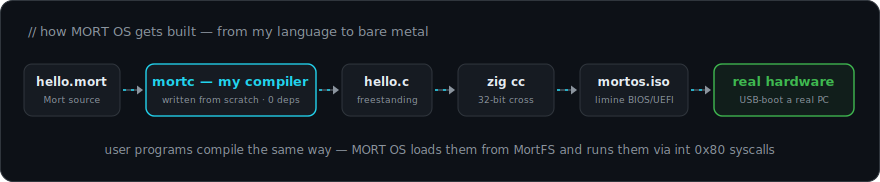
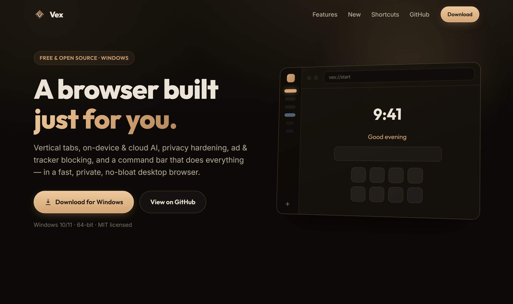
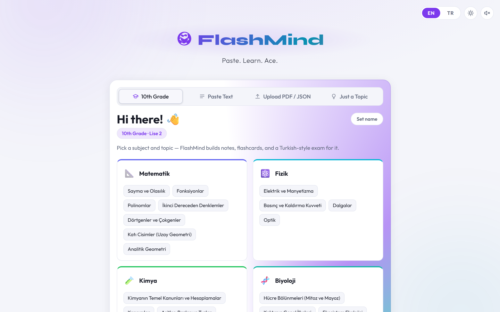

<div align="center">

<a href="https://0xmortuex.github.io">
  
</a>

<br/><br/>

<a href="https://0xmortuex.github.io/FlashMind/"><b>⚡&nbsp;try FlashMind</b></a>&nbsp;&nbsp;·&nbsp;&nbsp;<a href="https://0xmortuex.github.io/vex-website/"><b>⬇&nbsp;download Vex</b></a>&nbsp;&nbsp;·&nbsp;&nbsp;<a href="https://github.com/0xmortuex/Mort"><b>λ&nbsp;Mort</b></a>&nbsp;&nbsp;·&nbsp;&nbsp;<a href="https://github.com/0xmortuex/MortOS"><b>💾&nbsp;MORT OS</b></a>

</div>

<br/>

##  The Mort stack — I built a language, then wrote an OS in it

Most people learn a programming language. I wanted to know what's *underneath* — so I built **[Mort](https://github.com/0xmortuex/Mort)**: a statically-typed language whose entire compiler — lexer, parser, type checker, C code generator — is written from scratch in Python with **zero libraries**. Mort exists for one reason: **[MORT OS](https://github.com/0xmortuex/MortOS)**, an operating system written in it. Why does Mort compile to C instead of running on an interpreter? **Because an interpreter can't boot.**

At v0.40 Mort is no toy: it has a **versioned normative language specification** and a black-box conformance suite, move-only **resources with compile-time ownership checking**, generics, threads and atomics, and a standard library that speaks **TCP/UDP/DNS, bounded HTTP/1.1, RFC 6455 WebSockets, and the OS CSPRNG** — every release gated by 321 regression tests, adversarial fuzzing, and sanitizer runs across Windows, Linux, and macOS.

[](https://github.com/0xmortuex/Mort/actions/workflows/ci.yml)




```rust
fn fib(n: int) -> int {
    if n < 2 { return n; }
    return fib(n - 1) + fib(n - 2);
}
```

###  MORT OS — what the kernel does today

- **Boots real machines, not just QEMU** — Limine BIOS/UEFI hybrid ISO; write it to a USB stick and it boots a real PC in 32-bit protected mode
- **Drives real hardware** — interrupt-driven PS/2 keyboard, PIT timer, ATA PIO disk driver, framebuffer graphics with VGA text fallback, plus UHCI **USB enumeration** and **AC'97 audio** ([the reusable drivers have their own repo](https://github.com/0xmortuex/MortHardware))
- **Has its own filesystem** — MortFS v2, persistent across reboots, now **hierarchical**: directories, `/bin` `/etc` `/home` `/var`, per-file ownership, Unix permission bits, and modification times
- **Has users and `sudo`** — accounts with hashed passwords, enforced write permissions, `su`/`sudo`/`passwd`/`chmod`/`chown`, and a lock screen backed by the real account password
- **Runs user programs** — Mort programs compiled to flat binaries talk to the kernel through `int 0x80` syscalls, interactive keyboard input included — and the shell finds them **by name via `$PATH`**
- **Has a real shell** — a working directory with a path-aware prompt, environment variables with `$VAR` expansion (`export` · `env` · `unset`), and command history
- **Has a desktop** — a keyboard-driven **home launcher** with app icons, plus Terminal, Files, browser, and **Settings** apps on `F1`–`F4`

<div align="center">

<a href="https://github.com/0xmortuex/MortOS"></a>

<sub>MORT OS — the shell, drivers, filesystem, and window manager are all written in Mort.</sub>

</div>

> ✅ **[mortnet](https://github.com/0xmortuex/mortnet) is complete** — a TCP/IP stack for MORT OS, written from scratch in Mort. NIC driver → ARP → IPv4 → ICMP → UDP → DHCP → DNS → TCP → HTTP, every layer built and verified in QEMU. It's **vendored into [MORT OS](https://github.com/0xmortuex/MortOS)** and boots from a USB stick: type `net` to lease an IP over DHCP, `httpd` to [serve a page](https://github.com/0xmortuex/mortnet#readme) — a web server written in Mort, on an OS written in Mort, over a TCP/IP stack written in Mort.

**The Mort stack is now five repos**, one per layer of the system:

| | Repo | What it is |
|---|------|------------|
| λ | [**Mort**](https://github.com/0xmortuex/Mort) | The language — compiler, spec, conformance suite, and standard library |
| 💾 | [**MortOS**](https://github.com/0xmortuex/MortOS) | The OS — desktop, users, filesystem, syscalls, networking, all in Mort |
| 🌐 | [**mortnet**](https://github.com/0xmortuex/mortnet) | The TCP/IP stack — ARP to HTTP, from scratch, vendored into the kernel |
| 🔌 | [**MortHardware**](https://github.com/0xmortuex/MortHardware) | Reusable bare-metal drivers — PCI, RTL8139 Ethernet, AC'97 audio, UHCI USB + HID, PC speaker — with porting docs and test recipes |
| 📦 | [**mort-repo**](https://github.com/0xmortuex/mort-repo) | The package registry for `mpkg`, MORT OS's package manager — apt for an OS written from scratch |

## Vex — a browser I actually ship

A fast, private, minimal **Electron browser** with versioned releases, a changelog, and self-hosting docs. Arc-style vertical tabs and tab groups, a `Ctrl+K` command bar that does everything, ad & tracker blocking on by default, workspaces, tab sleep, split screen — and a **built-in AI agent** that summarizes pages, answers questions about what you're reading, and can click and type to complete tasks, running on a local Ollama model or your own cloud worker.

[](https://github.com/0xmortuex/Vex/releases/latest)
[](https://github.com/0xmortuex/Vex/releases)

**[⬇ Download for Windows](https://0xmortuex.github.io/vex-website/)** · [Latest release](https://github.com/0xmortuex/Vex/releases/latest) · [Self-hosting guide](https://github.com/0xmortuex/Vex/blob/main/SELF_HOSTING.md)

<div align="center">

<a href="https://0xmortuex.github.io/vex-website/"></a>

<sub>Vex — vertical tabs, built-in AI, ad blocking, and a command bar, in a no-bloat desktop browser.</sub>

</div>

##  FlashMind — the AI study engine I built for school

Paste notes, upload a PDF, snap a photo (OCR in English **and** Turkish), drop a YouTube link, or just name a topic — **FlashMind** turns it into summary notes, a 3D flip-card deck, and a Turkish-style mixed exam with AI-graded open-ended questions. Studying runs on a hand-rolled **FSRS-4.5 spaced-repetition** scheduler, with a mistake notebook that auto-files wrong answers, Feynman mode, streak tracking, and a 6-month analytics heatmap. No framework — vanilla JS with Claude doing the thinking through a Cloudflare Worker — and it exports to Anki, Markdown, and PDF.

**[⚡ Try FlashMind](https://0xmortuex.github.io/FlashMind/)** · [Source](https://github.com/0xmortuex/FlashMind)

<div align="center">

<a href="https://0xmortuex.github.io/FlashMind/"></a>

<sub>FlashMind — pick a subject or paste anything; it builds the notes, the deck, and the exam.</sub>

</div>

## Selected work

| | Project | Why it matters |
|---|---------|----------------|
| 🔍 | [**ReconX**](https://github.com/0xmortuex/ReconX) · [demo](https://0xmortuex.github.io/ReconX/) | Full-spectrum domain recon in one dashboard — DNS, WHOIS, SSL, headers, tech stack, subdomains |
| 🔑 | [**PassCrack**](https://github.com/0xmortuex/PassCrack) · [demo](https://0xmortuex.github.io/PassCrack/) | Password analyzer that simulates real attack techniques — crack times, pattern detection, entropy. 100% in-browser, zero data transmitted |
| 🛡️ | [**Roblox Anticheat: The Hard Way**](https://github.com/0xmortuex/roblox-anticheat-the-hard-way) | A written-from-scratch, production-grade server-side anticheat — every line explained, built as a teaching resource |
| 🎛️ | [**Nexus**](https://github.com/0xmortuex/Nexus) | Process Lasso-style Windows optimizer in WPF — per-exe priority/affinity/EcoQoS rules on hybrid CPUs, dynamic restraint under load, a crash-safe Game Mode journaled to disk, and every tweak backed up with working undo |
| 🧩 | [**RoSuite**](https://github.com/0xmortuex/RoSuite) | Free RoPro alternative as a Chrome extension — server browser, player info, trade calculator, game stats |
| 📖 | [**Zine**](https://github.com/0xmortuex/Zine) | A manga reader with an editorial, print-zine design language — paged & webtoon modes, smart page preloading, autoplay, six themes; React 19 + the MangaDex API |
| 🖥️ | [**MiniOS**](https://github.com/0xmortuex/MiniOS) · [demo](https://0xmortuex.github.io/MiniOS/) | The browser-OS experiment that grew into mortuexOS |

<details>
<summary><b>🔒 Security & OSINT</b> — 3 more projects</summary>
<br/>

| Project | Description | Live Demo |
|---------|-------------|-----------|
| [**NetMap**](https://github.com/0xmortuex/NetMap) | Visual traceroute on a world map — animated packets hop across the globe | [Demo](https://0xmortuex.github.io/NetMap/) |
| [**CipherLab**](https://github.com/0xmortuex/CipherLab) | Encryption playground — 13 ciphers with visual step-by-step breakdowns | [Demo](https://0xmortuex.github.io/CipherLab/) |
| [**CodeLens**](https://github.com/0xmortuex/CodeLens) | AI-powered code security auditor with quality scoring | [Demo](https://0xmortuex.github.io/CodeLens/) |

</details>

<details>
<summary><b>🤖 AI-powered tools</b> — 5 more projects</summary>
<br/>

| Project | Description | Live Demo |
|---------|-------------|-----------|
| [**LoopholeMap**](https://github.com/0xmortuex/LoopholeMap) | Find vulnerabilities in any regulation — interactive node graph + AI analysis | [Demo](https://0xmortuex.github.io/LoopholeMap/) |
| [**AIJudge**](https://github.com/0xmortuex/AIJudge) | Describe an argument, AI delivers a verdict with shareable court ruling cards | [Demo](https://0xmortuex.github.io/AIJudge/) |
| [**TermsTrap**](https://github.com/0xmortuex/TermsTrap) | ToS analyzer that finds hidden clauses with risk scoring | [Demo](https://0xmortuex.github.io/TermsTrap/) |
| [**DebateBot**](https://github.com/0xmortuex/DebateBot) | Dual-side AI debate analysis with evidence and rebuttals | [Demo](https://0xmortuex.github.io/DebateBot/) |
| [**LexScope**](https://github.com/0xmortuex/LexScope) | Interactive legislation explorer with AI suggestions | [Demo](https://0xmortuex.github.io/LexScope/) |

</details>

<details>
<summary><b>🛠 Apps, games & plugins</b> — 7 more projects</summary>
<br/>

| Project | Description | Live Demo |
|---------|-------------|-----------|
| [**mortuexOS**](https://github.com/0xmortuex/0xmortuex.github.io) | My portfolio as a desktop OS in the browser — windows, a taskbar, apps; web projects open inside it | [Demo](https://0xmortuex.github.io) |
| [**ChatRoom**](https://github.com/0xmortuex/ChatRoom) | Real-time anonymous chat with rooms — Cloudflare KV backend | [Demo](https://0xmortuex.github.io/ChatRoom/) |
| [**BillForge**](https://github.com/0xmortuex/BillForge) | CUSA legislative bill builder with templates and AI assist | [Demo](https://0xmortuex.github.io/BillForge/) |
| [**GitPulse**](https://github.com/0xmortuex/GitPulse) | GitHub profile visualizer with charts | [Demo](https://0xmortuex.github.io/GitPulse/) |
| [**TypeRush**](https://github.com/0xmortuex/TypeRush) | Typing speed game with code mode and achievements | [Demo](https://0xmortuex.github.io/TypeRush/) |
| [**steamogames**](https://github.com/0xmortuex/steamogames) | Live Steam player statistics — concurrent players, peaks, and trends | — |
| **Vencord plugins** | [InactivityTracker](https://github.com/0xmortuex/vencord-inactivitytracker) · [QuickNotes](https://github.com/0xmortuex/vencord-quicknotes) · [RoleMembers](https://github.com/0xmortuex/vencord-rolemembers) · ServerClock · DMOrganizer | — |

</details>

<br/>

## Stack

<div align="center">


</div>

## Stats

<div align="center">

<picture>
  <source media="(prefers-color-scheme: dark)" srcset="https://raw.githubusercontent.com/0xmortuex/0xmortuex/main/generated/overview-dark.svg" />
  
</picture>
<picture>
  <source media="(prefers-color-scheme: dark)" srcset="https://raw.githubusercontent.com/0xmortuex/0xmortuex/main/generated/languages-dark.svg" />
  
</picture>

<sub>No third-party stats services anywhere on this page — the cards above are generated by [a workflow in this repo](.github/workflows/stats.yml), and the banner &amp; toolchain diagrams are hand-written SVGs.</sub>

<br/><br/>

<picture>
  <source media="(prefers-color-scheme: dark)" srcset="https://raw.githubusercontent.com/0xmortuex/0xmortuex/output/github-contribution-grid-snake-dark.svg" />
  
</picture>

</div>

---

<div align="center">

<sub>Every web project above is open source and live on GitHub Pages. Not sure where to start? <a href="https://0xmortuex.github.io/FlashMind/"><b>Try FlashMind.</b></a></sub>

</div>
